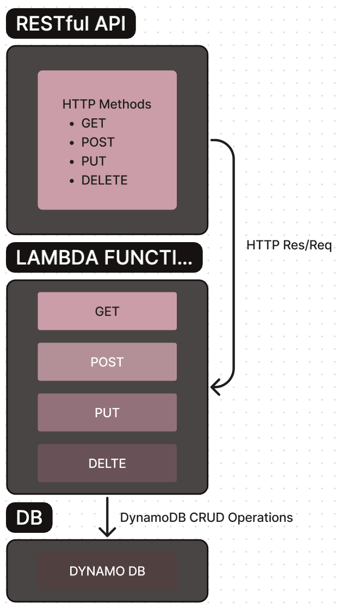

# Serverless Api

**Author**: Wajiha Khan

**Version**: 1.0.0

## Documenting Data and Program Flow

### Routes and Functions Mapping

1. **GET /people**
   - **Function:** Lambda function for retrieving all records.
   - **Input:** None
   - **Output:** Returns a list of all records in the "people" table.

2. **POST /people**
   - **Function:** Lambda function for creating a new record.
   - **Input:** JSON payload containing "name" and "phone" fields.
   - **Output:** Returns the newly created record.

3. **PUT /people/{id}**
   - **Function:** Lambda function for updating an existing record.
   - **Input:** JSON payload containing updated "name" and "phone" fields. Path parameter "id" identifies the record to be updated.
   - **Output:** Returns a success message if the record is updated successfully.

4. **DELETE /people/{id}**
   - **Function:** Lambda function for deleting an existing record.
   - **Input:** Path parameter "id" identifies the record to be deleted.
   - **Output:** Returns a success message if the record is deleted successfully.

### Data Flow

1. **GET /people**
   - **Request:**
     - The client sends an HTTP GET request to the "/people" endpoint.
   - **Function Execution:**
     - The Lambda function associated with the GET operation is triggered.
     - The Lambda function retrieves all records from the "people" table in DynamoDB.
   - **Response:**
     - The Lambda function returns a list of records as an HTTP response.

2. **POST /people**
   - **Request:**
     - The client sends an HTTP POST request to the "/people" endpoint with a JSON payload containing the new record's data.
   - **Function Execution:**
     - The Lambda function associated with the POST operation is triggered.
     - The Lambda function creates a new record in the "people" table in DynamoDB.
   - **Response:**
     - The Lambda function returns the newly created record as an HTTP response.

3. **PUT /people/{id}**
   - **Request:**
     - The client sends an HTTP PUT request to the "/people/{id}" endpoint with a JSON payload containing the updated record's data.
   - **Function Execution:**
     - The Lambda function associated with the PUT operation is triggered.
     - The Lambda function updates the specified record in the "people" table in DynamoDB.
   - **Response:**
     - The Lambda function returns a success message as an HTTP response if the record is updated successfully.

4. **DELETE /people/{id}**
   - **Request:**
     - The client sends an HTTP DELETE request to the "/people/{id}" endpoint, where {id} is the ID of the record to be deleted.
   - **Function Execution:**
     - The Lambda function associated with the DELETE operation is triggered.
     - The Lambda function deletes the specified record from the "people" table in DynamoDB.
   - **Response:**
     - The Lambda function returns a success message as an HTTP response if the record is deleted successfully.

[Documentation_Screenshots](./assets/)
